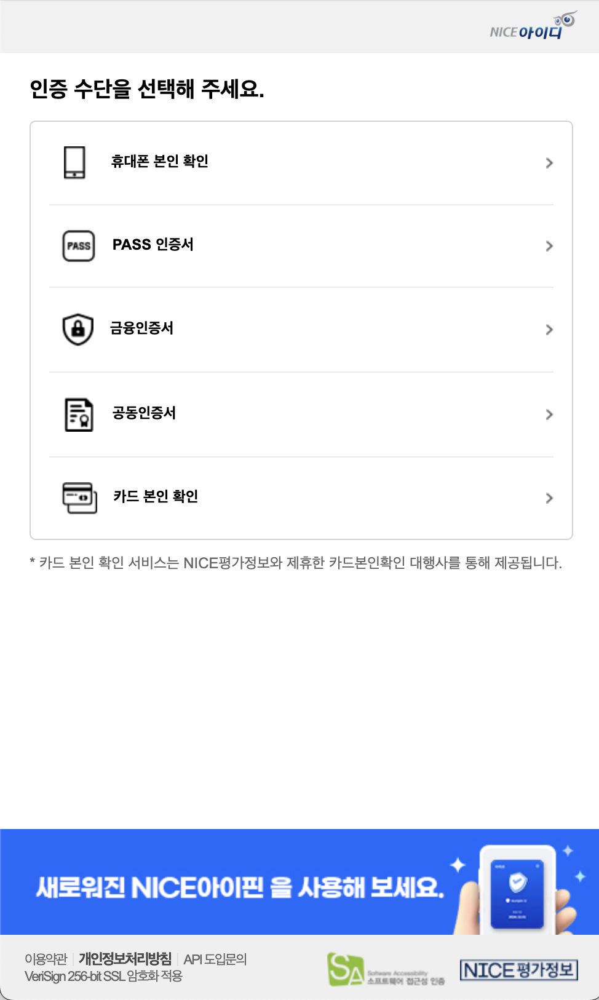
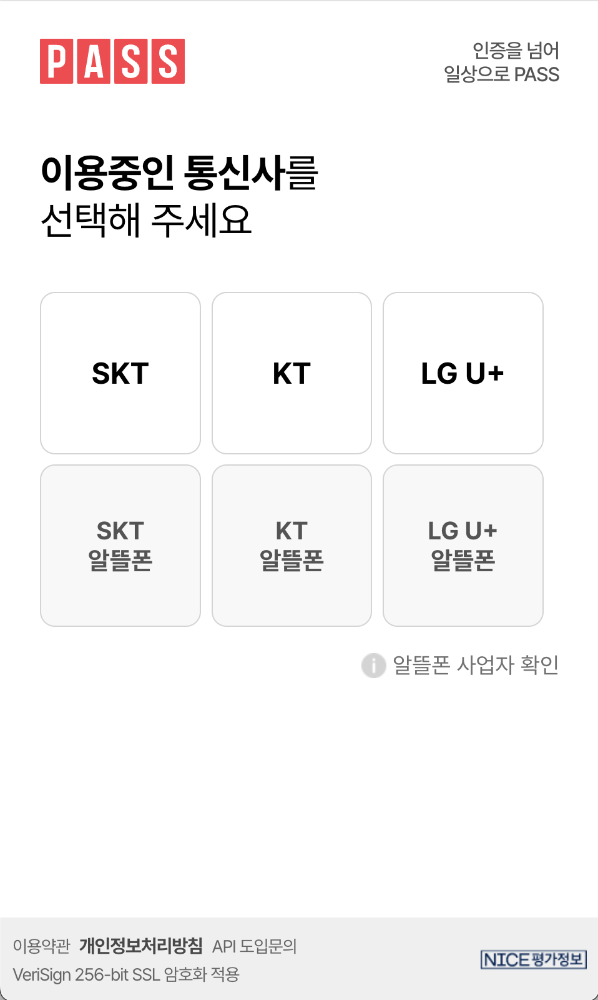
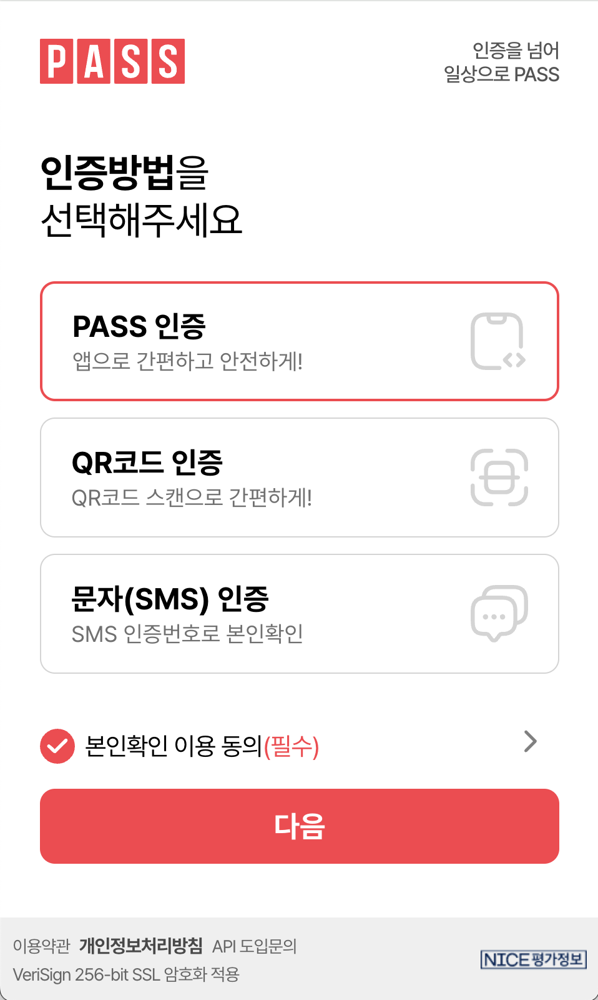
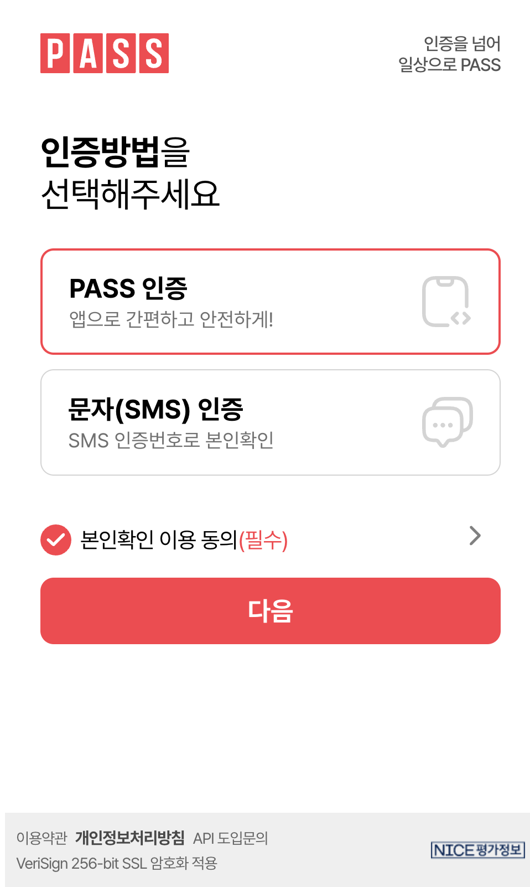

# ✅ NICE_ID 본인인증 모듈

Spring Boot 환경에서 본인인증 연동을 위한 예제 코드입니다.
본인인증 수단은 다음과 같으며, 제공되는 인증 수단은 계약정보에 따라 상이할 수 있습니다.

##  📌 1. 인증 수단 선택

 
    

 
 
<em>
    ① 인증 수단 선택 : 계약에 따라 초기에 표시되는 화면이 다릅니다. 
    (휴대폰 인증 등 한가지만 선택되었다면, 해당 인증수단 초기 화면으로 바로 전환됩니다.)
</em> &nbsp;&nbsp;&nbsp;&nbsp; 

##  📌 2. 인증 수단 상세 : 휴대폰 본인인증
### 📱휴대폰 본인인증

 
     
     
     

 
 <em>① 통신사 선택</em> &nbsp;&nbsp;&nbsp;&nbsp; 
<em>
    ② 인증 방법 선택 (PASS / QR / SMS) : 웹 기본 3버튼 노출 
    웹의 경우 3버튼이 기본 설정이지만, String customize = "Mobile" 설정을 통해 하기 2버튼 노출 가능 
    특정 버튼(1개) 만 원할 경우 계약담당자에게 문의
</em> 
&nbsp;&nbsp;&nbsp;&nbsp; 
<em>
    ③ 인증 방법 선택 (PASS / SMS) : 모바일 기본 2버튼 노출 
    특정 버튼(1개) 만 원할 경우 계약담당자에게 문의
</em> 

- `sRequestNumber`는 요청의 정합성을 위한 고유 식별자입니다.
- 세션을 사용할 수 없는 환경에서는 JWT로 보안을 대체할 수 있습니다.
- Swagger를 통해 API 테스트 문서를 연동할 수 있습니다.
- https://도메인주소/swagger-ui/index.html

