# ✅ NICE_ID 본인인증 모듈

Spring Boot 환경에서 본인인증 연동을 위한 예제 코드입니다.  
본인인증 수단은 다음과 같으며, 제공되는 인증 수단은 계약정보에 따라 상이할 수 있습니다.

---

## 📋 목차

- 인증 수단 선택
- 모듈 공통
- 인증 수단 상세 (휴대폰, PASS 인증서, 금융인증서, 공동인증서, 카드 본인확인)
- 방화벽 정보

---

## 📌 1. 인증 수단 선택

<p align="center">
  
</p>

**① 인증 수단 선택**  
계약에 따라 초기에 표시되는 화면이 다릅니다.  
(휴대폰 인증 등 한가지만 선택되었다면, 해당 인증수단 초기 화면으로 바로 전환됩니다.)

---

## 📌 2. 모듈 공통

- `TotalRestController.java`: 암호화 데이터 생성하기 위한 컨트롤러
- `TotalController.java`: 웹 화면을 표시하기 위한 컨트롤러  
  (모든 request는 `String` 타입입니다)
- 
**Request**

| 변수명       | 타입         | 설명                                                                                     |
|---------------|------------|------------------------------------------------------------------------------------------|
| `siteCode`     | String(필수) | 사이트 코드 (NICE 발급)                                                                   |
| `sitePassword` | String(필수) | 사이트 비밀번호 (NICE 발급)                                                               |
| `sAuthType`    | String(선택) | 인증 수단: 없으면 기본 선택화면 / M(휴대폰), X(인증서공통), U(공동인증서), F(금융인증서), S(PASS인증서), C(신용카드) |
| `customize`    | String(선택) | 없으면 기본 웹페이지 / Mobile: 모바일페이지                                               |
| `sReturnUrl`   | String(필수) | 인증 완료 후 리턴받을 주소 (클라이언트랑 분리된 환경일 경우 클라이언트 주소 입력)           |

`/checkPlusMain`
```json
{
  "siteCode": "A1234",
  "sitePassword": "12345678",
  "sAuthType": "M",
  "customize": "",
  "sReturnUrl": "https://niceapi.co.kr/checkplus_success"
}
```

**Response**

| 변수명     | 타입    | 설명                                                                 |
|------------|-------|----------------------------------------------------------------------|
| `iReturn`  | int   | 모듈 `fnEncode(siteCode, sitePassword, sPlainData)` 실행 결과         |
| `sMessage` | String | iReturn 값의 상세 메세지                                              |
| `sEncData` | String | 표준창을 호출하기 위한 데이터 (iReturn 값이 0일 때만 반환)             |

```json
{
  "iReturn": 0,
  "sMessage": "성공",
  "sEncData": "AgI**********************************************************************iSawO="
}
```
---

## 📌 3. 인증 수단 상세

### 📱 휴대폰 본인인증

#### 휴대전화 본인인증 - 인증 수단 선택
<p align="center">
  
  
  
</p>

**① 통신사 선택**

**② 인증 방법 선택 (PASS / QR / SMS)**
- 웹 기본 3버튼 노출
- `String customize = "Mobile"` 설정 시 모바일용 2버튼 노출 가능
- 특정 버튼(1개)으로 커스텀 시 계약담당자에게 문의

**③ 인증 방법 선택 (PASS / SMS)**
- 모바일 기본 2버튼 노출
- 특정 버튼(1개)으로 커스텀 시 계약담당자에게 문의

---

### ✅ PASS 인증 프로세스

<p align="center">
  
  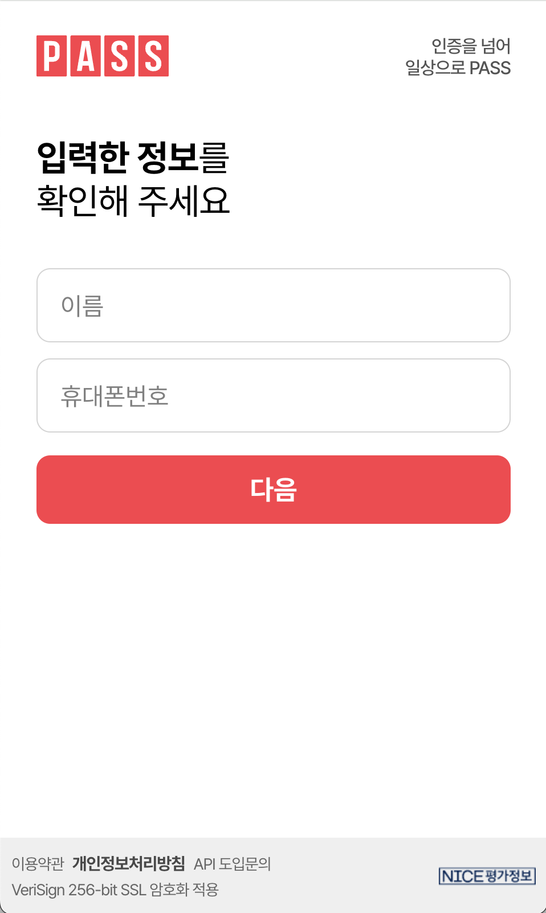
  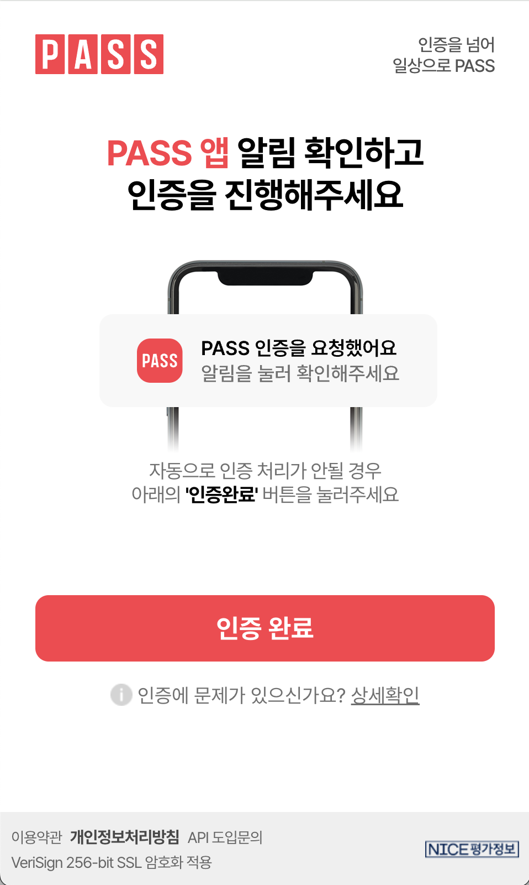
</p>


**① PASS (웹방식)**
- 웹에서 PASS 인증하기 버튼 클릭 시, 사용자 정보를 입력하고 사용자 휴대전화로 PUSH 알림이 전송됩니다.
- 모바일에서 PASS 인증하기 버튼 클릭 시, APPLink 우선으로 처리되어 PASS 앱으로 전환됩니다.
- 모바일 환경에서 사용자 입력 UI가 노출되면 웹뷰 → APPLink 전환이 되지 않아 PUSH 방식으로 처리된 것입니다.
- PUSH 우선 방식 설정을 원하시면 계약담당자에게 요청하세요.

---

### ❗ PASS 인증 오류

<p align="center">
  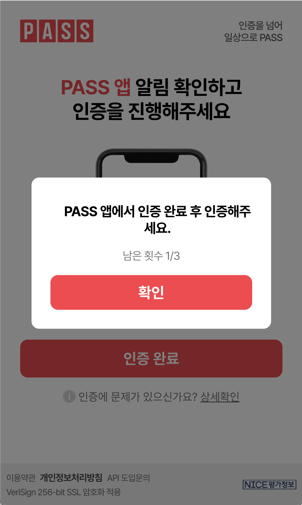
  
  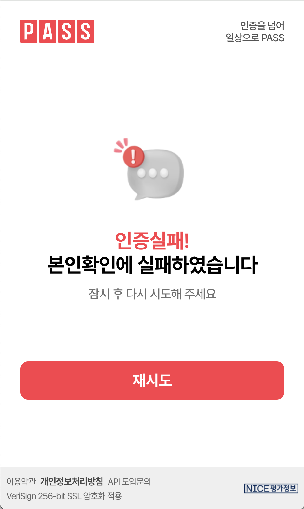
</p>

- PASS 앱에서 완료처리하지 않았을 때
- PASS 앱에서 인증 취소 후 인증 완료 버튼 클릭 시

---

### ✅ QR 코드 인증

<p align="center">
  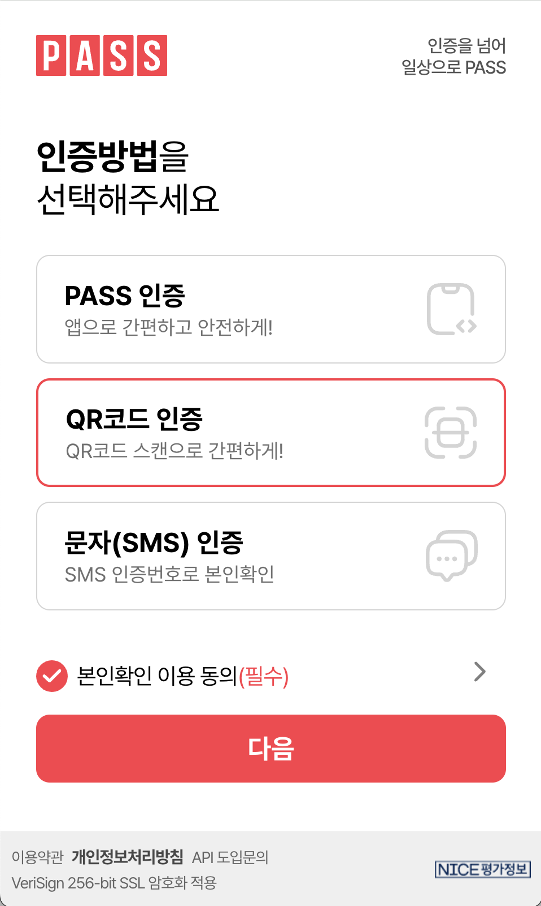
  
  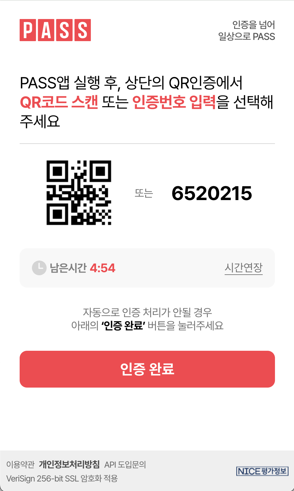
</p>

PASS 앱 > QR 인증 버튼 클릭 후 인증

---

### ✅ SMS 인증

<p align="center">
  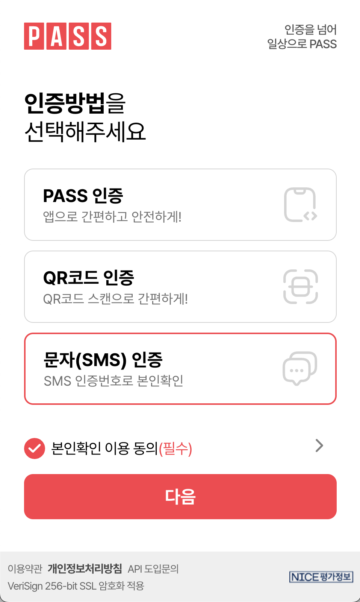
  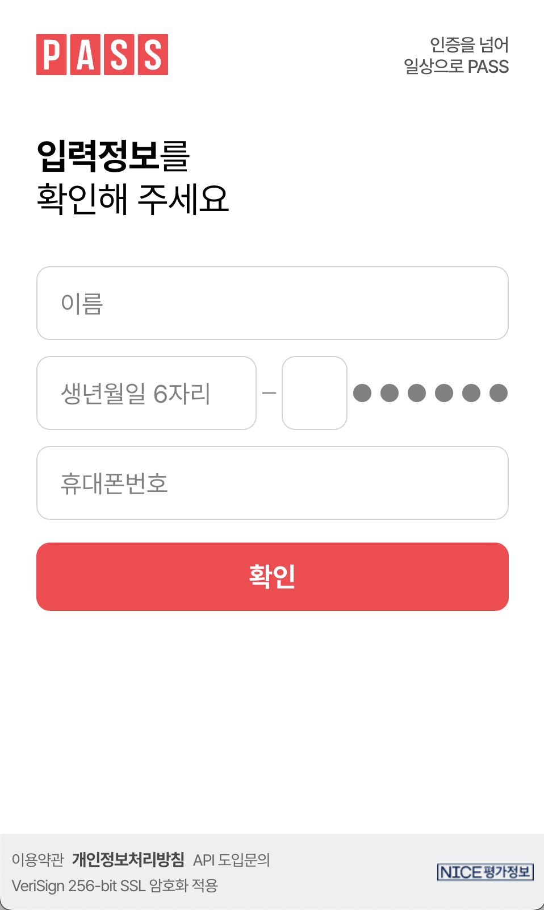
  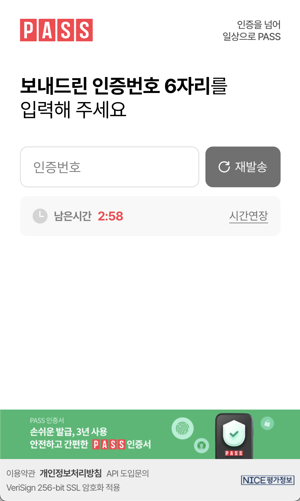
</p>


- 성함, 생년월일 6자리 + 성별, 휴대전화번호 입력 후 1차 검증
- 명의자 확인 시, 휴대전화로 OTP 번호 전송 → 인증번호 기입

---

### ❗ SMS 인증 오류: 입력값 검증

<p align="center">
  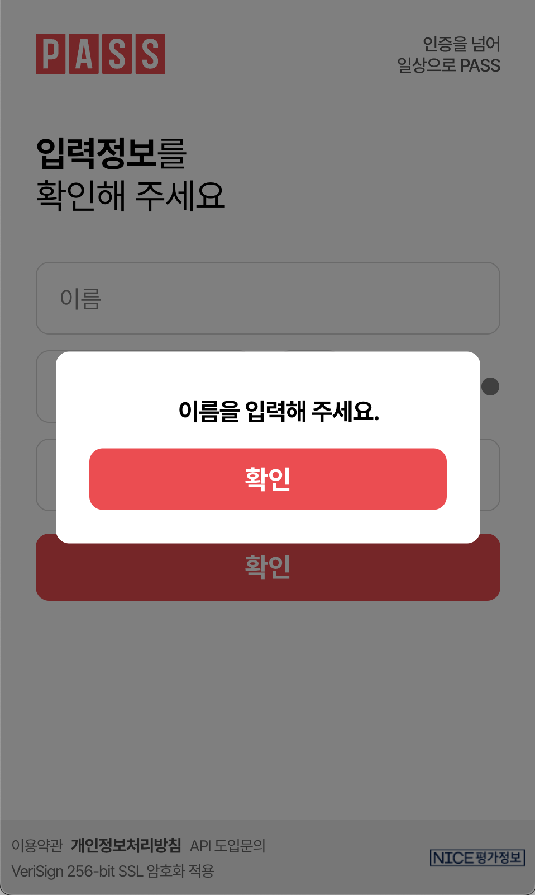
  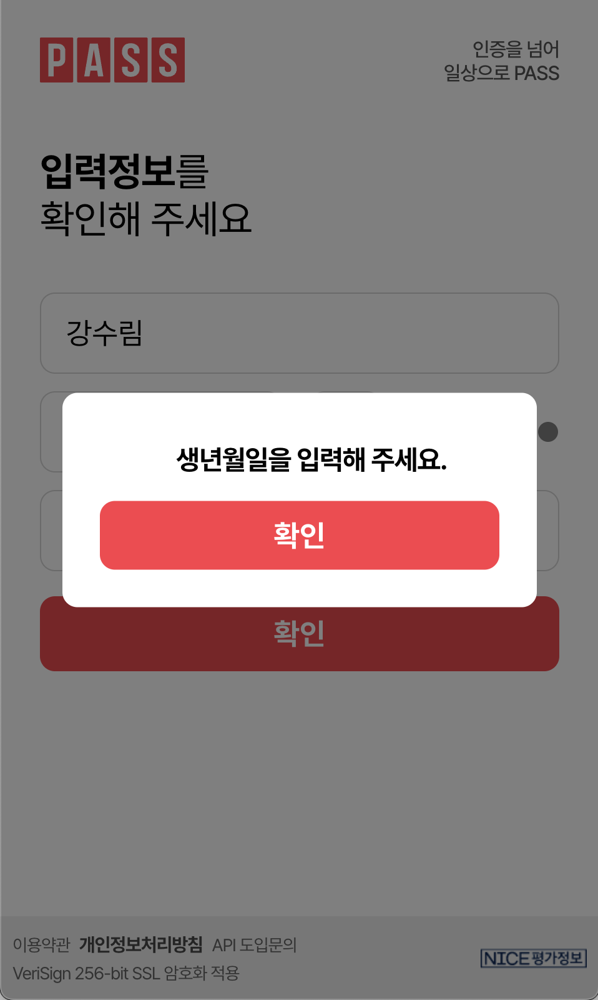
  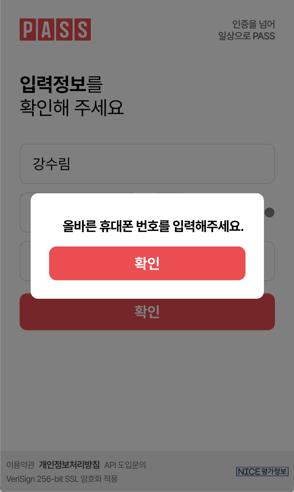
  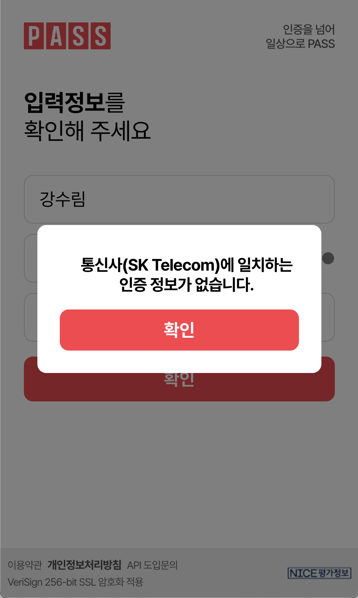
  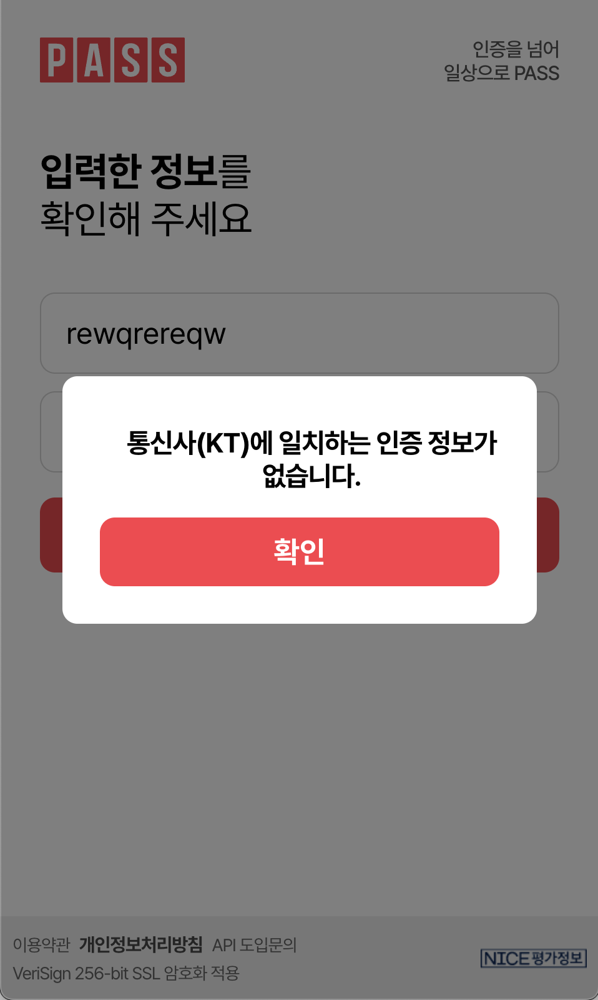
  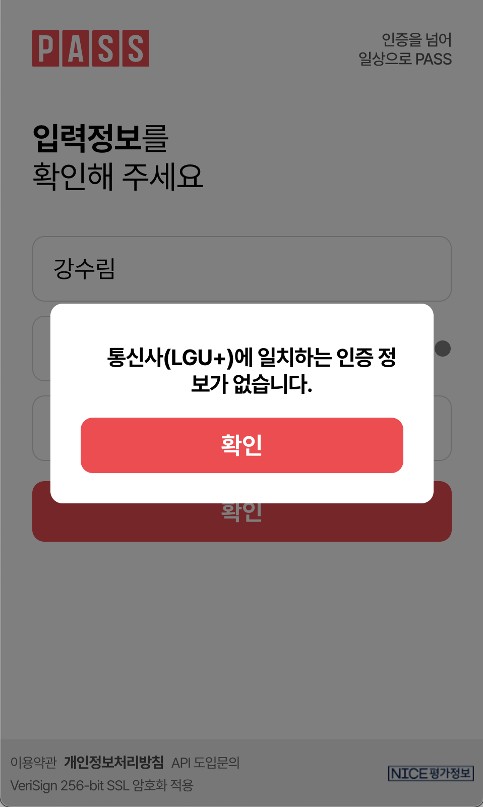
</p>

